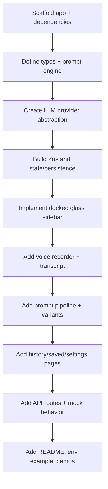

# PromptPilot

PromptPilot is a production-ready, desktop-style AI prompt assistant web app.  
It docks to the right side of the screen as a translucent overlay panel and transforms rough voice/text input into high-quality prompt-engineered outputs.

---

## What It Does

- Captures user intent from rough commands (voice or text).
- Classifies intent (`coding`, `scheduling`, `social`, `email`, etc.).
- Extracts requirements and optional task metadata.
- Generates a polished final prompt plus multiple variants.
- Supports one-click copy/export and local history/saved prompts.
- Includes target output modes for `ChatGPT`, `Claude`, `Gemini`, `Cursor`, and generic AI.

---

## Tech Stack

- **Framework**: Next.js (App Router), TypeScript
- **Styling**: Tailwind CSS + glassmorphism custom styling
- **UI**: shadcn/ui components
- **Animation**: Framer Motion
- **State**: Zustand (`persist` middleware for local storage)
- **Voice Input**: Web Speech API (`SpeechRecognition` / `webkitSpeechRecognition`)
- **Prompt Engine**: Modular service layer (`services/prompt-engine.ts`)
- **Backend API**: Next.js Route Handlers in `app/api/*`
- **Date Parsing Utility**: `date-fns`
- **Icons**: `lucide-react`

---

## Architecture Overview

```mermaid
flowchart LR
  A[Voice/Text Input] --> B[Prompt Assistant UI]
  B --> C[/api/classify-intent]
  B --> D[/api/generate-prompt]
  B --> E[/api/rewrite-prompt]
  B --> F[/api/extract-task]
  D --> G[LLM Provider Abstraction]
  C --> G
  E --> G
  F --> G
  G --> H[Prompt Engine]
  H --> I[Prompt Result + Variants]
  I --> J[UI Output Tabs]
  I --> K[History/Saved via Zustand Persist]
```

---

## Implementation Plan (Executed)



---

## Key Features Implemented

1. **Docked translucent sidebar**
   - Right-docked
   - Width resizable from 30% to 40%
   - Persistent collapsed state
   - Rounded left edge and glass effect

2. **Voice-first input**
   - Start/stop listening
   - Live transcript
   - Browser support + error handling fallback

3. **Prompt transformation pipeline**
   - Intent classification
   - Requirement extraction
   - Prompt engineering with role/objective/constraints/output guidance
   - Multi-tab variants (`standard`, `advanced`, `expert`, `copy-ready`)

4. **Smart actions**
   - Rewrite controls: shorten, expand, professional, creative
   - Task-aware UI block with due/reminder extraction for scheduling intents

5. **Output tooling**
   - Copy selected variant
   - Copy final prompt
   - Copy all variants
   - Export `.txt` / `.md`
   - Word count

6. **Persistence**
   - Recent history
   - Saved prompts
   - Settings in local storage

7. **Routes**
   - `/` main assistant
   - `/history`
   - `/saved`
   - `/settings`
   - `/demo`

---

## Project Structure

```txt
src/
  app/
    api/
      classify-intent/route.ts
      generate-prompt/route.ts
      rewrite-prompt/route.ts
      extract-task/route.ts
    demo/page.tsx
    history/page.tsx
    saved/page.tsx
    settings/page.tsx
    layout.tsx
    page.tsx
  components/
    assistant-header.tsx
    docked-sidebar.tsx
    glass-panel.tsx
    mini-collapsed-launcher.tsx
    prompt-assistant.tsx
    prompt-history-list.tsx
    prompt-input.tsx
    prompt-output-tabs.tsx
    saved-prompt-card.tsx
    settings-form.tsx
    smart-action-buttons.tsx
    voice-recorder.tsx
    ui/*
  hooks/
    use-sidebar-shortcut.ts
    use-voice-recorder.ts
  lib/
    mock-data.ts
    utils.ts
  services/
    llm-provider.ts
    prompt-engine.ts
  store/
    prompt-store.ts
  types/
    prompt.ts
```

---

## API Design

- `POST /api/generate-prompt`
  - input: rough command + settings
  - output: full prompt result + variants
- `POST /api/classify-intent`
  - input: rough command
  - output: intent label
- `POST /api/rewrite-prompt`
  - input: prompt + rewrite mode
  - output: rewritten prompt
- `POST /api/extract-task`
  - input: task-like command
  - output: parsed task metadata

The provider is abstracted in `services/llm-provider.ts` and currently uses a mock implementation.  
You can swap to a real OpenAI-compatible provider without touching UI components.

---

## Cursor Build Mode

When target mode is set to `Cursor`, prompt instructions are automatically shaped toward software implementation:
- architecture-aware structure
- file planning guidance
- execution-oriented output expectations

---

## Setup

1. Install dependencies:

```bash
npm install
```

2. Create environment file:

```bash
cp .env.example .env.local
```

3. Start dev server:

```bash
npm run dev
```

4. Open [http://localhost:3000](http://localhost:3000)

---

## Keyboard Shortcut

- `Ctrl + Shift + P`: toggle sidebar open/collapse

---

## Notes for Production Hardening

- Replace mock provider with actual OpenAI-compatible API call flow.
- Add server-side key encryption and secure settings storage.
- Add auth + cloud sync (Supabase-ready extension point).
- Add robust date parser for natural language scheduling.
- Add test coverage (unit + integration + route handlers).
- Add optional Google Calendar adapter in a new scheduler service.
